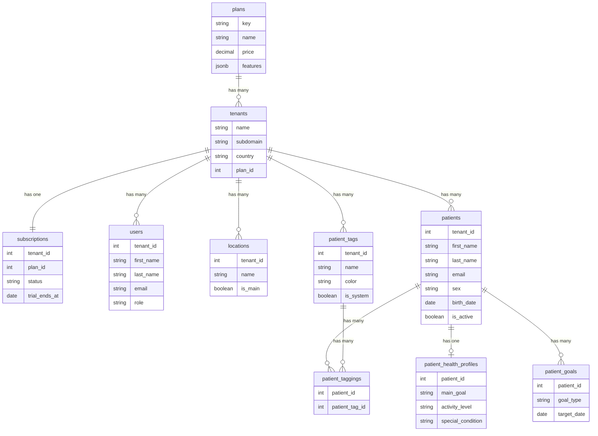

# Micaela

> B2B SaaS platform for nutritionists in LATAM — patient management, appointments, clinical measurements and meal plans.

## Repositories

| Repo | Description | Stack |
|------|-------------|-------|
| [api](https://github.com/micaela-app/api) | REST API | Rails 8 · PostgreSQL 16 |
| [web](https://github.com/micaela-app/web) | Frontend app | React 19 · TypeScript · Vite |

## Architecture

```
app.micaela.app          → central login (multi-tenant)
nutrifit.micaela.app     → branded subdomain per tenant
app.nutrifit.pe          → custom domain (BUSINESS plan)
```

- Each client = one **tenant** (nutritional center)
- Auth: JWT in HttpOnly cookie — tenant resolved from user, not URL
- Multitenancy: [acts_as_tenant](https://github.com/ErwinM/acts_as_tenant)

## Plans

| Plan | Price | Professionals | Features |
|------|-------|---------------|----------|
| Free | $0 | 1 | Core features |
| Pro | $19/mo | 3 | Google Calendar · PDF export · Statistics |
| Business | $59/mo | 5 | White label · Custom domain |

## Data Model



## Stack

```
Backend:      Rails 8 API · PostgreSQL 16
Frontend:     React 19 · TypeScript · Vite · Tailwind CSS v4
Auth:         JWT · HttpOnly cookie · JTI denylist
Storage:      Active Storage · S3
Jobs:         Sidekiq · Redis
Emails:       ActionMailer · SendGrid
Serializers:  Blueprinter
Pagination:   Pagy
```
